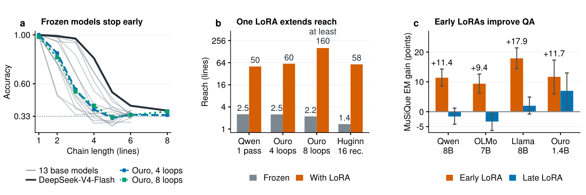

# Transformers Stop Thinking Too Early, and a Tiny LoRA Fixes It

**Zehao Jin, Ruixuan Deng, Junran Wang** · Georgia Institute of Technology

[Project page and interactive demo](https://lunamos.github.io/stop-thinking-too-early/) · [arXiv:2609.36585](https://arxiv.org/abs/2609.36585) · Video: [YouTube](https://youtu.be/zauTNrrZQW8), [Bilibili (CN)](https://www.bilibili.com/video/BV1Ymad68Eof)



Give a pretrained transformer a chain of references in its prompt (`K = apple`, `B = K`, `D = B`, …, `print(D)`) and ask for
the answer directly. Thirteen base models from 0.6B to 32B parameters reliably follow only 1.4 to 3.6 lines, and extra
pretrained loops add little. A rank-8 LoRA at one early layer, with every model weight frozen, changes this:
- Qwen3-8B goes from 15.5% to 99% exact accuracy on 24-line chains, and a longer-trained LoRA reaches 50 lines.
- Ouro-1.4B follows 60 lines after four loops and at least 160 after eight.

The LoRA starts a relay along the program that the frozen middle layers carry. It helps only while enough of those layers still
follow it.

## Repository

| Folder | Contents |
|---|---|
| `scripts/` | Experiment code: one script per experiment (`e*.py`) and shared helpers; see `scripts/README.md`. |
| `analysis/` | Computes the paper's tables, checks and figures from the experiments' outputs, on a CPU (`analysis/build.sh`). |
| `data/` | How to export the MuSiQue selection. |
| `docs/` | The project page. |

`REPRODUCE.md` maps each result of the paper to its script and gives the commands we ran. The experiment scripts write their
outputs (JSON result files and the trained LoRA weights) to `results/`, and the analysis scripts read them from there.

## Setup

    python -m venv .venv-std  && .venv-std/bin/pip install -r requirements-standard.txt     # Python 3.12
    python -m venv .venv-loop && .venv-loop/bin/pip install -r requirements-looped.txt      # Python 3.11, Ouro and Huginn
    export HF_HOME=/path/to/a/large/cache

The headline LoRA (Qwen3-8B, layer 14). Training and evaluation take about 16 minutes on one A100:

    cd scripts
    ../.venv-std/bin/python e19_reentry.py Qwen/Qwen3-8B-Base --tag vdeep_q8_r8_kl1 --band 14:23 --no_loop --rank 8 \
        --chains 2 --dmax 20 --var_pool upperlower --depths_eval 4,8,12,16,20,24 --steps 1200 --kmax 1 --text_kl 1.0

In the code the one-layer LoRA is called a *map* (`--kind map`, `--map FILE`). `REPRODUCE.md` lists the other names.

## Citation

```bibtex
@article{jin2026thinking,
  title   = {Transformers Stop Thinking Too Early, and a Tiny {LoRA} Fixes It},
  author  = {Jin, Zehao and Deng, Ruixuan and Wang, Junran},
  journal = {arXiv preprint arXiv:2609.36585},
  year    = {2026},
  url     = {https://arxiv.org/abs/2609.36585}
}
```

## License

The code is released under the Apache License 2.0 (see `LICENSE`). The models and datasets keep their own licenses.
